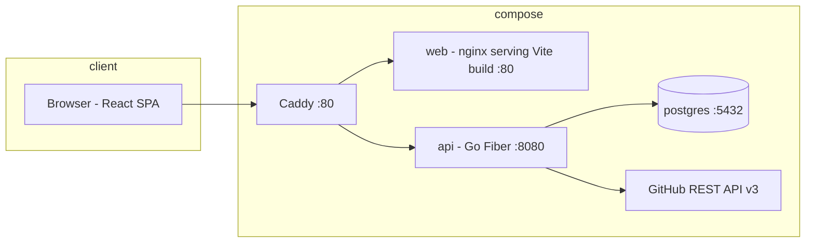

# Architecture — kica

Single repo, three services in Compose. See [[brief]], [[domain]], [[api-contract]].



## Services

| Service | Image | Notes |
|---|---|---|
| api | golang:1.23-alpine build → scratch/distroless | Fiber + GORM, env config, health `/api/health` |
| web | node:22-alpine build → nginx:alpine | Vite SPA, static, `try_files` history fallback |
| postgres | postgres:17-alpine | volume `pgdata`, healthcheck pg_isready |
| caddy | caddy:2-alpine | single port :80, `/api/*`→api, rest→web. `ponytail:` TLS + kica.apta.works at deploy time |

## Repo layout (single repo)
```
kica/
  api/          # Go module
    cmd/server/main.go
    internal/{config,db,models,middleware,handlers,auth,github,services}
    internal/db/migrations/  # SQL files, golang-migrate
  web/          # Vite React TS
  docs/         # copied from vault
  deploy/
    Caddyfile
  docker-compose.yml
  Dockerfile.api, Dockerfile.web
  .env.example
```

## Auth
JWT (HS256), 12h expiry, httpOnly cookie `kica_session`, SameSite=Lax. Login refreshes. Middleware: parse JWT → load user → reject disabled. CSRF: SameSite=Lax + JSON-only APIs (no form posts) is v1 stance.

## Config (env)
`DATABASE_URL`, `JWT_SECRET`, `ADMIN_EMAIL`, `ADMIN_PASSWORD` (seed on first boot), `GITHUB_API_BASE` (default https://api.github.com, overridable for tests).

## GitHub integration
api holds PAT per project (AES-256-GCM, key = env `GH_ENC_KEY` 32 bytes base64). Create-issue call: `POST /repos/{owner}/{repo}/issues`, timeout 10s, retry once on 5xx. No webhooks v1.

## Position ordering
Fractional float position per (project, status). Rebalance column when neighbor gap < 1 (rewrite all positions in that column as 1024-spaced). Single transaction.

## Deployment
Local-first. Later: same compose behind real Caddy with TLS on a VM, domain kica.apta.works. Backups = `pg_dump` cron; PATs encrypted at rest so dumps safe-ish, still protect them.

## Testing stance
- api: `go test` — auth, permissions matrix, position math, task numbering, GH link idempotency (mock HTTP).
- web: `vitest` — board store moves, filters. Playwright happy-path login→board→drag later, not v1 gate.
