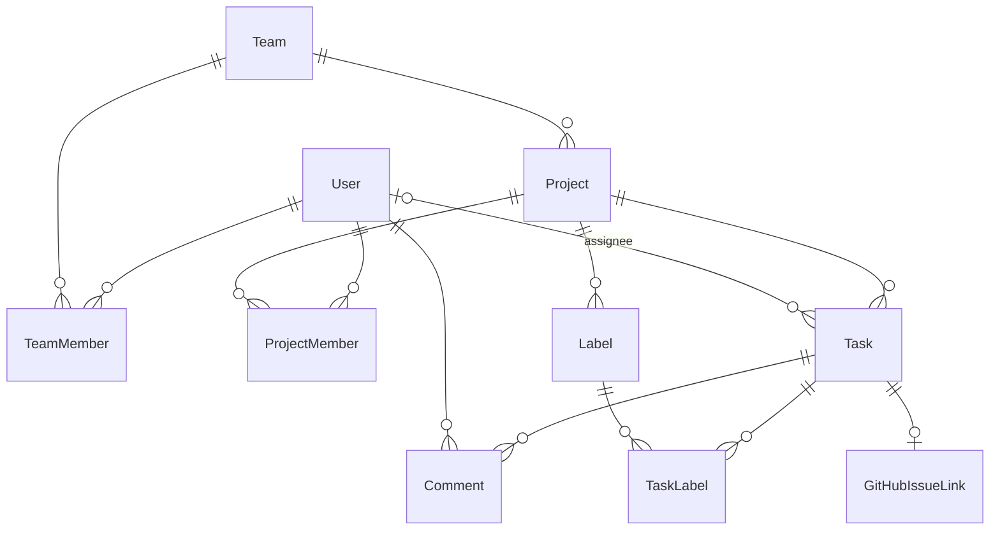

# Domain Model — kicca

Entities, relationships, rules. See [[PRD]] for scope, [[api-contract]] for wire format.

## Entities

### User
| Field | Type | Notes |
|---|---|---|
| id | uuid PK | |
| email | citext unique | login id |
| password_hash | string | bcrypt |
| name | string | |
| global_role | enum(admin, member) | |
| disabled_at | timestamp null | soft disable; blocks login |

### Team
| Field | Type | Notes |
|---|---|---|
| id | uuid PK | |
| name | string unique | |
| slug | string unique | URL segment |

### TeamMember
(team_id, user_id) PK — membership join. No team roles v1. `ponytail:` add team_role if org grows.

### Project
| Field | Type | Notes |
|---|---|---|
| id | uuid PK | |
| team_id | FK Team | |
| name | string | |
| key | string unique | short code, e.g. `KIC`; task numbers `KIC-123` |
| description | text | |
| gh_repo | string null | `owner/name` |
| gh_token_enc | bytes null | AES-256-GCM ciphertext of PAT |
| task_seq | bigint | per-project task number counter (default 0) |

### ProjectMember
(project_id, user_id, role enum(project_admin, member)) PK. Multiple project_admins allowed.

### Task
| Field | Type | Notes |
|---|---|---|
| id | uuid PK | |
| project_id | FK | |
| number | bigint | per-project, from project.task_seq++; unique (project_id, number) |
| title | string | required |
| description | text | markdown |
| status | enum(inbox, backlog, in_progress, review, done, blocked, trash) | |
| priority | enum(urgent, high, medium, low) | default medium |
| assignee_id | FK User null | 0..1 |
| created_by | FK User | |
| due_date | date null | |
| position | float | order within column; fractional indexing on move |
| labels | m:n Label | |
| timestamps | created_at, updated_at, deleted_at null | GORM soft delete = trash state |

### Label
| Field | Type | Notes |
|---|---|---|
| id | uuid PK | |
| project_id | FK | scoped per project |
| name | string | unique per project |
| color | string | hex |

### Comment
| Field | Type | Notes |
|---|---|---|
| id | uuid PK | |
| task_id | FK Task | cascade delete |
| user_id | FK User | |
| body | text | markdown |
| created_at | timestamp | editable window 15 min `ponytail:` |

### GitHubIssueLink
| Field | Type | Notes |
|---|---|---|
| id | uuid PK | |
| task_id | FK Task unique | one link per task (enforces idempotency) |
| repo | string | `owner/name` snapshot |
| issue_number | int | |
| issue_url | string | |
| created_by | FK User | |
| created_at | timestamp | |

## Relationships

## Rules
1. **Visibility:** a User sees a Project iff global admin OR ProjectMember. Enforced in every project-scoped query.
2. **Task number:** assigned atomically on create (`UPDATE project SET task_seq=task_seq+1 ... RETURNING`) — no gaps matter.
3. **Position:** on create → max(position)+1024 in column; on move → midpoint between neighbors; rebalance when gap < 1. `ponytail:` float fine to ~50 moves depth; integer-list rebalance is upgrade.
4. **Trash:** soft-delete sets status=trash + deleted_at; restore clears both; trashed excluded from board/list defaults, included on `status=trash` filter.
5. **GitHub create:** requires gh_repo + gh_token_enc on project; fails 422 if task already linked; issue body = description + footer linking back optional. PAT decrypted only in-memory for the call.
6. **Permissions matrix:**

| Action | Global admin | Project admin | Member |
|---|---|---|---|
| Manage users/teams | ✅ | ❌ | ❌ |
| Create/delete project | ✅ | ❌ | ❌ |
| Manage project members/labels/GH config | ✅ | ✅ | ❌ |
| Create/edit/move/comment tasks | ✅ | ✅ | ✅ |
| Trash/restore tasks | ✅ | ✅ | ✅ |

7. **Disabled user:** existing JWT rejected at middleware check (disabled_at lookup), sessions effectively dead; assigned tasks keep assignee (shows name, greyed).
