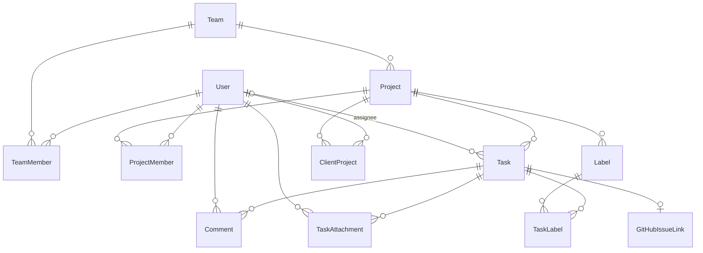

# Domain Model — kica

Entities, relationships, rules. See [[PRD]] for scope, [[api-contract]] for wire format.

## Entities

### User
| Field | Type | Notes |
|---|---|---|
| id | uuid PK | |
| email | citext unique | login id |
| password_hash | string | bcrypt |
| name | string | |
| global_role | enum(admin, member, client) | client = portal-only (#32) |
| disabled_at | timestamp null | soft disable; blocks login |

### Team
| Field | Type | Notes |
|---|---|---|
| id | uuid PK | |
| name | string unique | |
| slug | string unique | URL segment |

### TeamMember
(team_id, user_id) PK — membership join. No team roles v1. `ponytail:` add team_role if org grows.

### Project
| Field | Type | Notes |
|---|---|---|
| id | uuid PK | |
| team_id | FK Team | |
| name | string | |
| key | string unique | short code, e.g. `KIC`; task numbers `KIC-123` |
| description | text | |
| gh_repo | string null | `owner/name` |
| gh_token_enc | bytes null | AES-256-GCM ciphertext of PAT |
| task_seq | bigint | per-project task number counter (default 0) |

### ProjectMember
(project_id, user_id, role enum(project_admin, member)) PK. Multiple project_admins allowed.

### ClientProject
(client_id → users.id, project_id) PK (#32). Admin-managed links: the projects a client may submit tickets into. Clients have NO ProjectMember row — every team-scoped query excludes them by construction; role isolation is 403 both ways (team ↔ client).

### Task
| Field | Type | Notes |
|---|---|---|
| id | uuid PK | |
| project_id | FK | |
| number | bigint | per-project, from project.task_seq++; unique (project_id, number) |
| title | string | required |
| description | text | markdown |
| status | enum(inbox, backlog, in_progress, review, done, blocked, trash) | |
| priority | enum(urgent, high, medium, low) | default medium |
| type | enum(task, bug, feature, chore) | default task — analytics: type mix |
| estimate | int null | story points, >= 0 — analytics: burndown/velocity |
| assignee_id | FK User null | 0..1 |
| created_by | FK User | |
| due_date | date null | |
| position | float | order within column; fractional indexing on move |
| labels | m:n Label | |
| started_at | timestamp null | analytics: first entry into in_progress/review, never overwritten |
| done_at | timestamp null | analytics: entry into done; cleared on reopen (rule 8) |
| timestamps | created_at, updated_at, deleted_at null | GORM soft delete = trash state |

### TaskEvent
Analytics transition log — one row per status change (rule 8). Also surfaced read-only as the activity timeline (#44): `GET /api/tasks/:id/events` (team, visibility like the task) and `GET /api/client/tickets/:id/events` (own tickets only; actor serialized as `{name}` — no email).
| Field | Type | Notes |
|---|---|---|
| id | uuid PK | |
| task_id | FK Task | cascade delete |
| actor_id | FK User | who made the change |
| from_status | string null | null = creation event |
| to_status | string | |
| at | timestamp | |

### Label
| Field | Type | Notes |
|---|---|---|
| id | uuid PK | |
| project_id | FK | scoped per project |
| name | string | unique per project |
| color | string | hex |

### Comment
| Field | Type | Notes |
|---|---|---|
| id | uuid PK | |
| task_id | FK Task | cascade delete |
| user_id | FK User | |
| body | text | markdown |
| created_at | timestamp | editable window 15 min `ponytail:` |

### TaskAttachment (#34)
| Field | Type | Notes |
|---|---|---|
| id | uuid PK | |
| task_id | FK Task | cascade delete |
| filename | text | sanitized display name |
| content_type | text | server-sniffed (http.DetectContentType), never client-declared |
| size_bytes | bigint | capped by ATTACHMENTS_MAX_MB (default 25) |
| storage | text | 'local' \| 's3' — backend snapshot at upload time |
| object_key | text | opaque blob key (uuid + extension); S3 bucket is app-wide, never per-project |
| created_by | FK User | team member or the ticket's client |
| created_at | timestamp | |

Allowed content types: png, jpeg, webp, gif, mp4 (video/mp4), mov (video/quicktime), webm.

### GitHubIssueLink
| Field | Type | Notes |
|---|---|---|
| id | uuid PK | |
| task_id | FK Task unique | one link per task (enforces idempotency) |
| repo | string | `owner/name` snapshot |
| issue_number | int | |
| issue_url | string | |
| created_by | FK User | |
| created_at | timestamp | |

## Relationships

## Rules
1. **Visibility:** a User sees a Project iff global admin OR ProjectMember. Enforced in every project-scoped query.
2. **Task number:** assigned atomically on create (`UPDATE project SET task_seq=task_seq+1 ... RETURNING`) — no gaps matter.
3. **Position:** on create → max(position)+1024 in column; on move → midpoint between neighbors; rebalance when gap < 1. `ponytail:` float fine to ~50 moves depth; integer-list rebalance is upgrade.
4. **Trash:** soft-delete sets status=trash + deleted_at; restore clears both; trashed excluded from board/list defaults, included on `status=trash` filter.
5. **GitHub create:** requires gh_repo + gh_token_enc on project; fails 422 if task already linked; issue body = description + footer linking back optional. PAT decrypted only in-memory for the call.
6. **Permissions matrix:**

| Action | Global admin | Project admin | Member |
|---|---|---|---|
| Manage users/teams | ✅ | ❌ | ❌ |
| Create/delete project | ✅ | ❌ | ❌ |
| Manage project members/labels/GH config | ✅ | ✅ | ❌ |
| Create/edit/move/comment tasks | ✅ | ✅ | ✅ |
| Trash/restore tasks | ✅ | ✅ | ✅ |

7. **Disabled user:** existing JWT rejected at middleware check (disabled_at lookup), sessions effectively dead; assigned tasks keep assignee (shows name, greyed).
8. **Analytics stamps:** first entry into in_progress/review sets started_at (never overwritten); entry into done sets done_at; leaving done clears it (re-done re-stamps). Every status change (create counts, from NULL) writes a task_events row in the same transaction.
9. **Client tickets (#32):** a client submits tickets only into linked projects (ClientProject row, else 404 no-leak); each lands as a Task with status=inbox, created_by=client, normal per-project numbering. Clients see only tickets they created (in linked projects) — never assessment or other team-only fields. Clients get 403 on all team endpoints; team users get 403 on /client/*. A client keeps ≥1 project link (enforced on create/patch).
10. **Attachments (#34):** storage is S3 when S3_BUCKET is set (credentials via the default AWS chain, optional S3_ENDPOINT), else a local dir (ATTACHMENTS_DIR, default /data/attachments, a mounted volume). Team attaches on any visible task; clients only on their own tickets, and their list/stream is limited to attachments they created (created_by check — mirror of the GET auth). Uploads: multipart `file`, content type sniffed server-side against the allowlist, size capped by ATTACHMENTS_MAX_MB. Creating a GitHub issue embeds each attachment via presigned S3 URL only (GitHub has no public upload API — probed; web-UI upload needs a browser session, not a PAT). Images ``, videos bare URL; 24h expiry. An attachment never blocks the issue: S3 presigns, local storage skips + logs.
